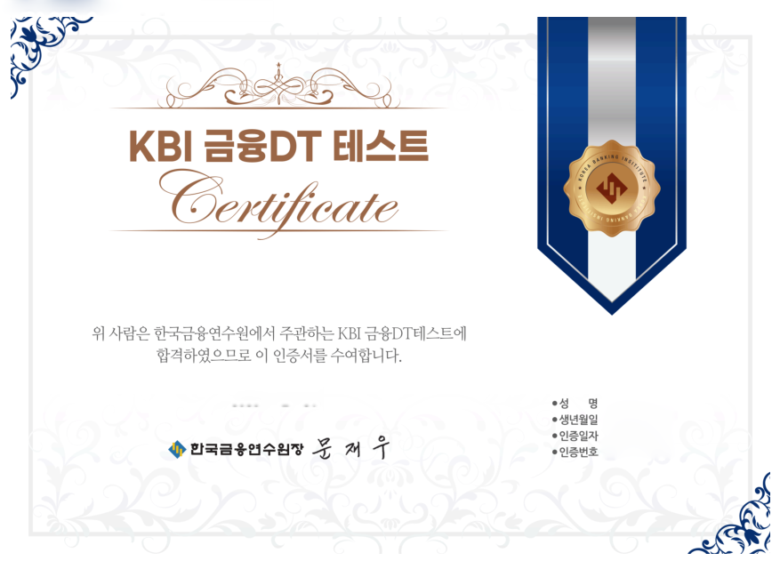

# KBI 금융DT 테스트, 무슨 시험인가?
## 목적
1. 금융인 및 예비 금융인들에게 금융의 디지털 트랜스포메이션(DT)에 대한 마인드 확산.
2. 금융인 및 예비 금융인들의 DT 관련 기본역량 제고

## 인증기준
### 지식
금융DT 분야의 포괄적 기본 지식
### 기술
금융DT 분야의 일상적 업무를 수행하고 일상적 문제를 해결하는 데 필요한 기술
### 소양
금융DT 분야의 트렌드와 이슈를 이해하고 이를 자신의 업무수행에 활용

