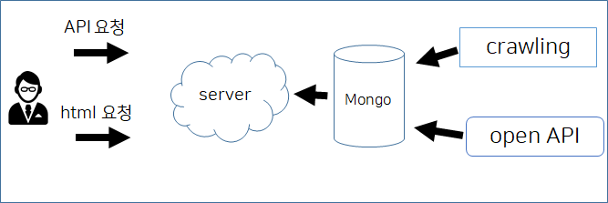
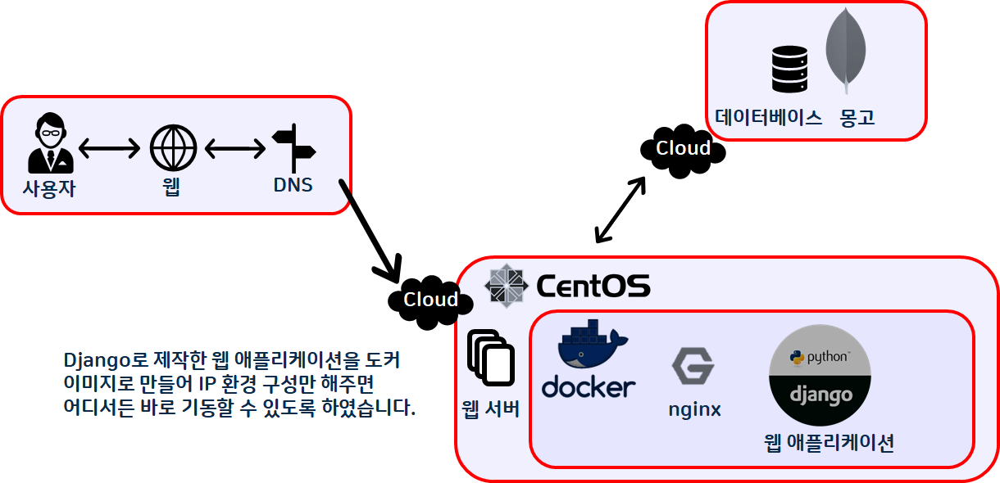
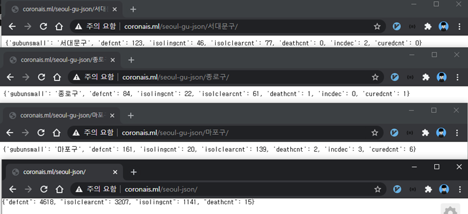

# CORONAIS

# 코로나 상황 웹 페이지 - 팀 프로젝트

Django, MongoDB

## 제공 기능

- 전국 코로나 상황 (누적 데이터, 일별 데이터)
- 지역별 코로나 상세 상황 (현재 변동 데이터)
- 코로나 관련 기사

## 개발환경

- 프로젝트 기간: 2020. 08. 10 ~ 2020. 09. 04
- 개발 플랫폼: Windows 10
- 개발 툴: Pycharm
- 언어: python 3.7.4
- 기술 스택: Web crawling, BeautifulSoup, MongoDB
- Repo: github.com/resourceSaga/CORONAIS_2nd
- Web URL : coronais.ml

## 구조

## 배포 인프라

## 기능 설명

### 서울 상세 데이터 API

- 앞서 수집한 서울 데이터를 가공하여 REST API 방식으로 데이터를 제공합니다.
- /seoul-json/ : 서울 전체의 확진자, 완치자, 검사자 , 사망자
- /seoul-gu-json/<구이름> : 구이름 별 데이터를 제공
- Django, MongoDB, json, HttpResponse

### 지역별 상세 현황

- 각 지자체의 홈페이지에서 제공하는 코로나 관련 데이터 (누적 확진자, 누적 사망자, 누적 완치자 등) 를 크롤링하여 수집, 계산으로 가공한 후 일별 확진자 추이, 지역별 감염 추이
데이터를 그래프를 통해 시각화하여 제공합니다.
- Django, MongoDB, BeautifulSoup, chart.js

## 후기

MariaDB를 사용하려고 했으나 데이터 간 의미 있는 관계가 없다고 판단하여데이터 형식에 유연함을 가진 MongoDB를 사용하였습니다.
Django 와 MongoDB 모두 처음 사용해보는 것이었지만 공부 내용을 바로 적용해 볼 수 있어 재미있게 진행할 수 있었습니다.

팀 프로젝트는 끝이 났지만, 서비스 기능의 범위가 아직 부족하다 생각되어 아쉬움이 많이 남은 프로젝트입니다. 때문에, 현재 가공 데이터를 API로 제공해 줄 수 있는 API를 이용해 만들어 상황을 간단히 알려줄 수 있는 챗봇을 기획하고 있으며, 가능하다면 서비스의 데이터 처리 범위를 전국으로 확대하고 싶어 2차 프로젝트를 준비 중 입니다.

도커를 이용하여 어디서든 이미지를 내려받으면 바로 실행 가능한 환경을 처음 구축해보았는데 컨테이너 이용의 파워풀함과 확장력이 가진 잠재력을 느낄 수 있었습니다. CentOS 환경에서 nginx 와 django를 연동함에 어려움이 많았지만 공부하며 nginx의 구성을 공부해 볼 수 있어 흥미로웠습니다.

## 담당 작업 외

