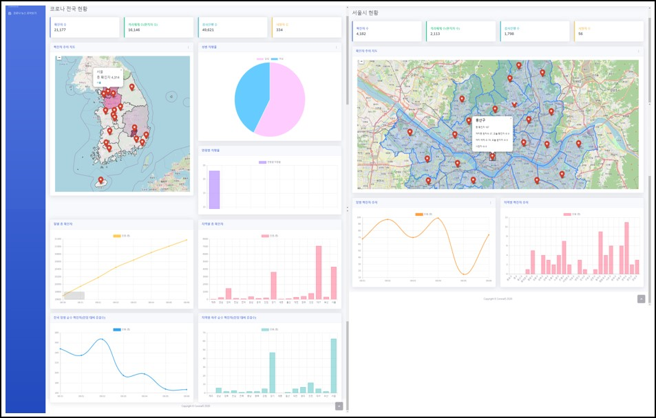
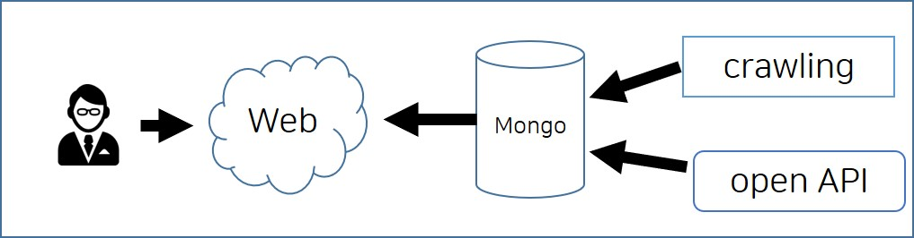
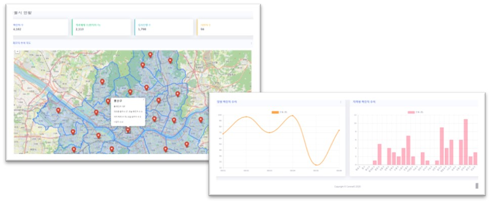
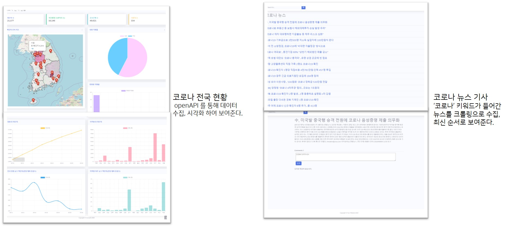

# CORONAIS

# 코로나 상황 웹 페이지 - 팀 프로젝트

Django, MongoDB

## 제공 기능

- 전국 코로나 상황 (누적 데이터, 일별 데이터)
- 지역별 코로나 상세 상황 (현재 변동 데이터)
- 코로나 관련 기사

## 개발환경

- 프로젝트 기간: 2020. 08. 10 ~ 2020. 09. 04
- 개발 플랫폼: Windows 10
- 개발 툴: Pycharm
- 언어: python 3.7.4
- 기술 스택: Web crawling, BeautifulSoup, MongoDB
- Repo: github.com/resourceSaga/CORONAIS_2nd

## 구조

## 기능 설명

### 지역별 상세 현황

- 각 지자체의 홈페이지에서 제공하는 코로나 관련 데이터 (누적 확진자, 누적 사망자, 누적 완치자 등) 를 크롤링하여 수집, 계산으로 가공한 후 일별 확진자 추이, 지역별 감염 추이
데이터를 그래프를 통해 시각화하여 제공합니다.
- Django, MongoDB, BeautifulSoup, chart.js

## 후기

 Django는 MVT 이라는 새로운 패턴을 사용하는데 MVC 패턴과 거의 동일하지만 사용해보며 장고의 View는 조금 더 컨트롤러의 역할에 의미를 둔다고 느꼈습니다.

 MariaDB를 사용하려고 했으나 데이터 간 의미 있는 관계가 없다고 판단하여 데이터 형식에 유연함을 가진 MongoDB를 사용하였습니다.

 Django 와 MongoDB 모두 처음 사용해보는 것이었지만 공부 내용을 바로 프로젝트에 적용해 볼 수 있어 재미있게 진행할 수 있었습니다.

 팀 프로젝트는 끝이 났지만, 서비스 기능이 많이 부족하다 생각되고, 배포하지 않아 아쉬움이 많이 남은 프로젝트입니다. 때문에, 현재 가공 데이터를 API로 제공해 줄 수 있는 서비스를 만들고 API를 이용해 상황을 간단히 알려줄 수 있는 봇과 CORONAIS 페이지 직접 배포하기 위해 포크하여 2차 프로젝트를 진행 중 입니다.

## 담당 작업 외

