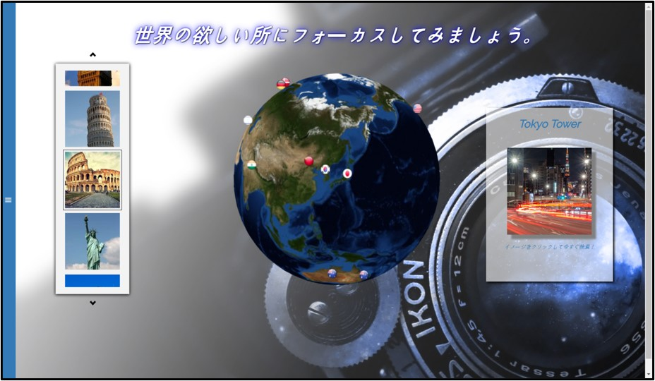
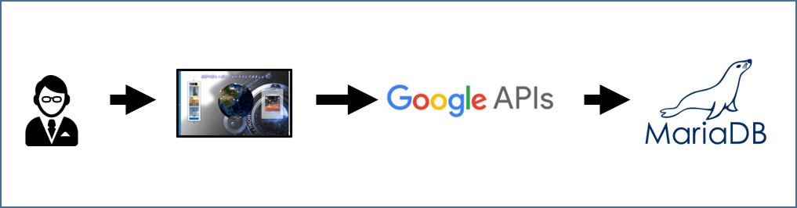
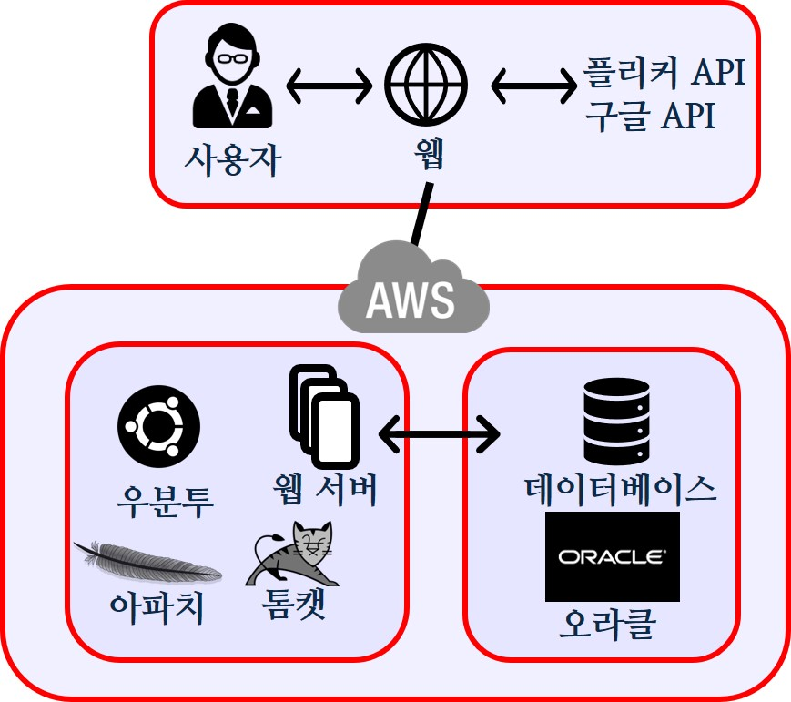
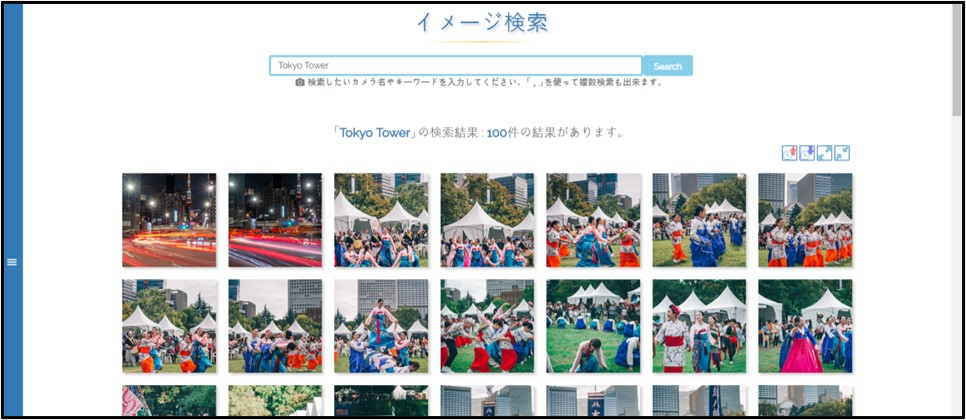
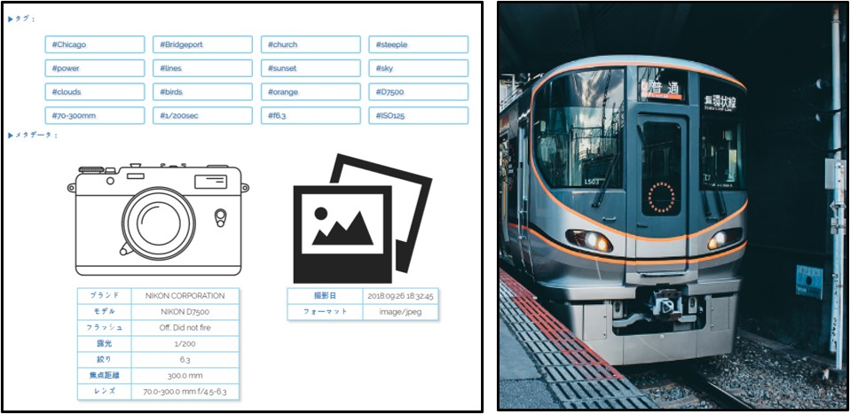
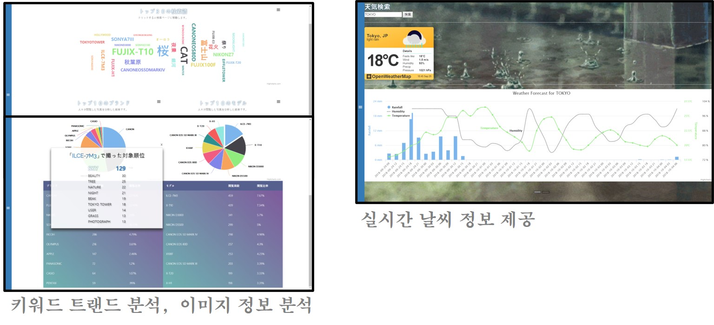

# ICT-MD

# 코로나 종합/상세 시각화 정보 제공 사이트

Django, MongoDB

## 제공 기능

- 랜드마크의 최신 사진을 검색해 제공
- 키워드 검색으로 사진 검색해 제공
- 사진분석으로 관련 이미지 제공
- 사진 파일의 메타데이터 분석
- 트랜드 분석과 이미지 정보 분석
- 실시간 날씨 정보 제공

## 개발환경

- 프로젝트 기간: 2018. 07. 19 ~ 2018. 09. 28
- 개발 플랫폼: Windows 10
- 개발 툴: Spring Tool Suite, sqldeveloper
- 언어: Java(JDK 1.8), SQL, HTML, CSS, JavaScipt
- 배포환경: AWS EC2 (Ubuntu)
- Repo: github.com/resourceSaga/ictmd

## 블루프린트

## 기능 설명

### 사진 검색

- 단일 혹은 복수의 키워드를 이용하여 사진 검색 기능을 제공합니다. 검색 결과는 사진의 업로드 시간을 기준으로 정렬 할 수 있게 하였습니다. 검색 내역은 DB에 저장되어 검색어 순위 제공에 이용됩니다. 키워드를 이용하여 유사한 내용 또한 함께 제공합니다.
- Flickr API (이미지 검색), JAVA (Spring framework)

### 이미지 분석

- 검색된 이미지를 유저가 클릭하게 되면 자세한 이미지 정보를 제공합니다. 이미지 분석 api를 통해 인식 가능한 관련 키워드를 모두 제공하며, 이미지에 메타데이터(카메라 기종, 촬영 환경의 정보)가 있다면 함께 제공됩니다. 또한, 분석된 데이터는 DB에 저장되어 이후 키워드 추천에 이용됩니다.
- Google Cloud Vision API (이미지 분석, 키워드 추출), JAVA (Spring framework)

## 후기

Java Springframe를 공부하기 위해 모인 팀원 사이에 공통 관심사인 카메라를 주제로 프로젝트를 진행하게 되었습니다.

인스타그램과 같은 한국에서 유명한 대형 포털의 데이터를 API를 통해 이용하려 하였으나, 프로젝트 설계 중 서비스 중단으로 계획 단계에서 자료조사에 예상보다 시간이 걸렸던 프로젝트였습니다.
이미지 데이터의 분석 처리를 이용하다 보니 대용량 데이터로 인해 지연이 있어, 응답 대기시간을 초과하는 등, REST API호출에 문제가 발생했습니다. 다양한 시도 끝에 이미지 리사이징과 스레드를 이용해 해결할 수 있었습니다.
여러 REST API를 동시에 이용하며 다양한 이슈를 경험하며 공부가 되었던 프로젝트였습니다.

## 담당 작업 외

