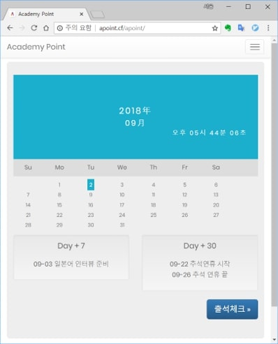
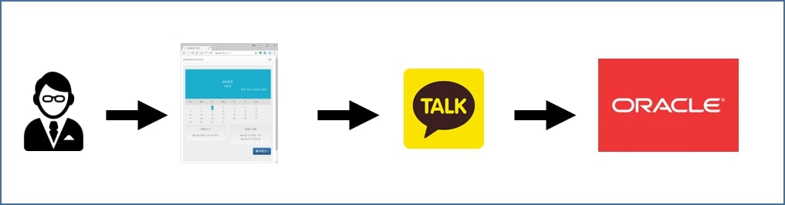
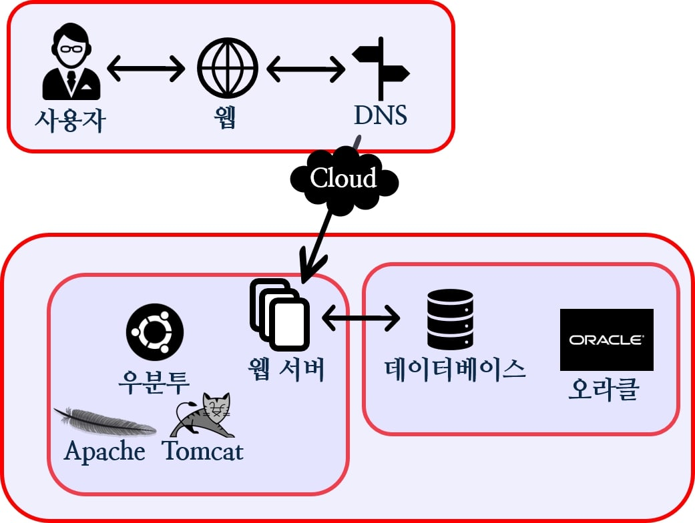
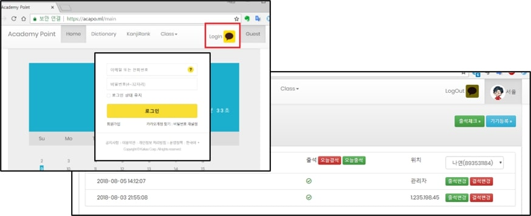
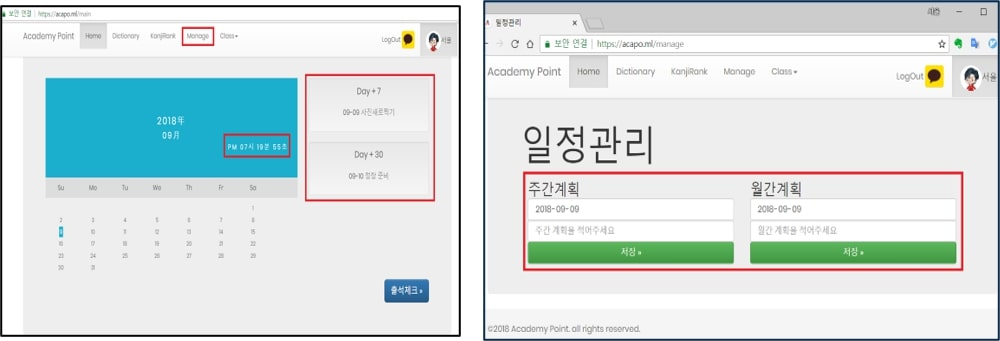
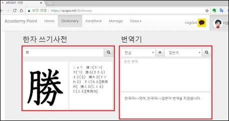

# 학습도움웹 - 개인 프로젝트

Spring Framework

## 제공 기능

- 기기 등록을 통한 출결 관리
- 공지 알림
- 사전
- 번역

## 개발환경

- 프로젝트 기간: 2018. 02. 19 ~ 2018. 04. 02
- 개발 플랫폼: Windows 10
- 개발 툴: Spring Tool Suite, sqldeveloper
- 언어: Java(JDK 1.8), SQL, HTML, CSS, JS
- 배포환경: AWS EC2 - Ubuntu
- Repo: github.com/resourceSaga/Academy-Point

## 블루프린트

## 기능 설명

### 로그인, 출석체크

- 카카오 API를 이용해 계정 로그인을 한 후 사용자 인증을 합니다. 로그인한 사용자의 정보를 파싱 받아 DB에 저장하고, 회원정보 관리에 이용합니다.
사용자는 출석하기 위해 기기를 등록하고, 이후 IP비교를 통해 출석체크를 하게 됩니다. 관리자는 모든 회원의 출석정보를 볼 수 있으며, 내용 변경 또한 가능합니다.
- REST API, Oauth 2.0, JSON, net library InetAddress

### 스케줄 알림, 캘린더, 실시간 시간

- 실시간 시간을 제공해주며, 날짜에 따른 일주일, 한달의 일정을 알려줍니다. 관리자에게만 접근이 허용된 Manage 메뉴를 통해 일정을 관리합니다.
- Ajax, URI interceptor, Session

### 한자사전, 번역기

- 한자 사전과 번역 기능을 이용하기 위해서는 로그인해야만 사용 할 수 있습니다. 한자 검색 시 네이버 사전과 웹 크롤링을 이용해 해당 한자의 데이터를 제공합니다. 이때, 네이버 Papago SMT를 이용해 번역하며. 인코딩 변환으로 한자를 파싱 하였습니다.
- URLEncoder, regex, jsoup, JSON, Naver Open API

### 한자 랭킹 시스템

- 일본 도쿄에 거주하는 트위터 이용자들의 일상 생활에 대한 주제의 피드 내용을 바탕으로 많이 사용된 한자를 추출해 랭킹으로 제공합니다. 이를 통해 상용한자를 알 수 있습니다.
- Twitter Open API, Oauth 2.0

## 후기

학원을 다니며 편하게 일정을 관리하고 공부에 필요한 기능이 있는 웹을 만들어 학생들에게 도움이 되고자 프로젝트를 진행하였습니다.

한자를 파싱하면서 인코딩 문제를 처음만나 문제에 많은 시간을 소비 했던 것이 아쉬웠지만, 혼자 프로젝트를 진행하면서 다양한 공부가 되었습니다.
들어만 보았던 토큰방식의 인증을 직접 사용하였는데 간단하고 database에 비밀번호를 저장할 필요 없다는 좋은 점을 직접 체험해보니 Oauth을 사용하는 이유를 알게되는 경험이 되었습니다. 서버를 SSL 인증서를 발급해 https를 적용하며 아파치 톰켓의 환경설정을 해보았는데 이를 통해서 서버의 작동원리를 더욱 이해하게 되었습니다.
