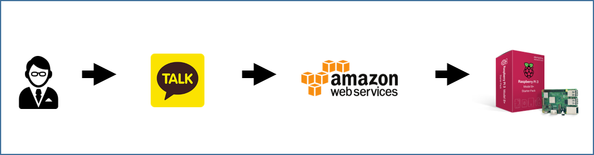
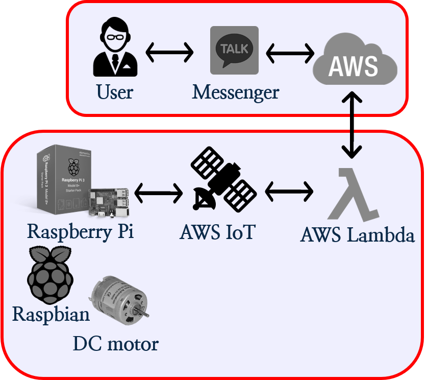
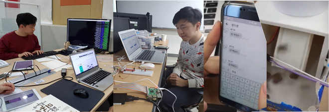
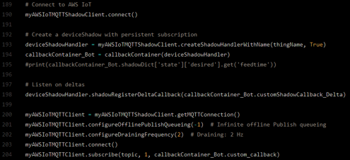
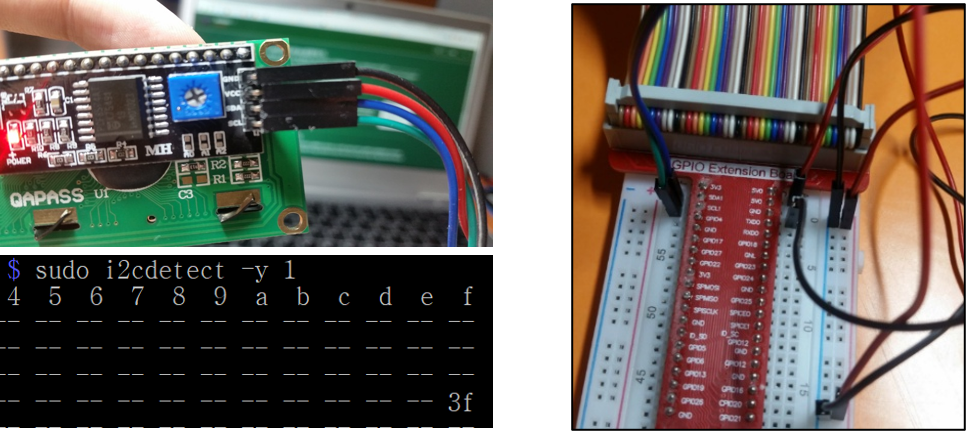

# 원격 사료 배급기- 팀 프로젝트

Spring Framework

## 제공 기능

- 챗봇 메신저를 이용한 원격 사료 배급기

## 개발환경

- 프로젝트 기간: 2017. 10. 16 ~ 2017. 12. 29
- 개발 플랫폼: Raspbian (debian)
- 개발 툴: Vim
- 기술스택: Python, C++, MQTT, HTTP
- 배포환경: AWS Lambda
- Repo: [github.com/resourceSaga/Academy-Point](https://github.com/resourceSaga/RaspberryPI_RC)
- Video: [youtube.com/watch?v=f9k5ICDXXuE](http://youtube.com/watch?v=f9k5ICDXXuE)

## 블루프린트

AWS IoT, AWS Lambda, AWS Gateway 사용 서버리스 구동

## 구현 기능

### MQTT protocol Listening

- 라즈베리파이는 MQTT 프로토콜을 이용해 항상 메시지 수신대기 상태입니다.
AWS IoT는 인터넷에 연결된 모듈의 AWS Lambda와 상호작용을 중계하며, 메시지가 도착한 경우 알맞은 함수를 실행시킵니다.
이 프로젝트에서는 DC모터를 작동하는 프로그램을 실행하였습니다.
- AWS IoT, MQTT protocol, Python

### DC Mortor Control

- i2c 인터페이스를 이용하여 DC모터와 시계를 제어합니다. 수신된 명령어에 따라 DC Mortor를 실시간 제어 또는 프로그램 시간 예약 함수를 작동하여, 시간에 따라 모듈의 모터를 작동합니다.
- i2c interface, C++, python

## 후기

실제 모듈을 제어해본 경험은 처음이었기 때문에 어려웠지만 친구를 돕겠다는 동기로 시작한 프로젝트 이었기 때문에 하나씩 기능이 구현될 때마다 즐거움이 더욱 컸습니다.

3D 모델링을 위해서 디자인 공학 팀원과 함께 진행하였는데전공지식의 차이로 의사소통에 문제가 있었지만, 새로운 말하기 방법을 도입해 해결 할 수 있었습니다. 협업 과정에서 생긴 문제로 경험할 수 있었던 일들과 의사소통 해결법은 앞으로의 업무과정에서도 도움이 되리라 생각합니다.
